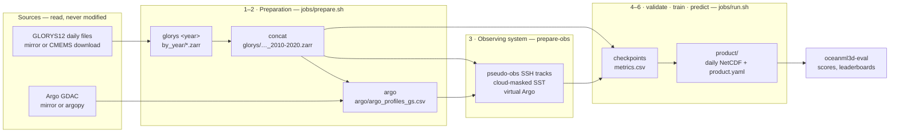

# oceanml3d-core

Reconstruct the three-dimensional ocean — temperature and horizontal currents on 21 depth levels,
plus sea surface height — from the sparse observations that actually exist: altimeter tracks,
cloud-masked sea surface temperature, and Argo profiles. Deep models (a U-Net trunk, an iterative
4DVarNet) are trained on an **OSSE**, where a reanalysis (GLORYS12) is the known truth and the
observing system is simulated on it, and compared on the same footing with classical data
assimilation (optimal interpolation, an ensemble Kalman filter) and non-learned baselines. Each run
exports a gridded product that [`oceanml3d-eval`](https://github.com/aitmohandk/oceanml3d-eval) scores.

The same code runs on a laptop, on Datarmor (PBS Pro) and on Jean Zay (Slurm), in one container.

Derived from [`4dvarnet-fm-opencode`](https://github.com/CIA-Oceanix/4dvarnet-fm-opencode) and
[`NOSC`](https://github.com/aitmohandk/NOSC), and independent of both — see `PROVENANCE.md`.
Licence EUPL-1.2.

**New here?** [`docs/tutorial.md`](docs/tutorial.md) builds a pipeline end to end, step by step —
first a ten-minute rehearsal on your own machine with the real tools and the real configuration, then
the same steps on a cluster.

---

## Contents

1. [The pipeline in one picture](#1-the-pipeline-in-one-picture)
2. [Install and a first run](#2-install-and-a-first-run)
3. [What it does — the complete list](#3-what-it-does--the-complete-list)
4. [How a pipeline runs, step by step](#4-how-a-pipeline-runs-step-by-step)
5. [Where things are: repository, data, runs](#5-where-things-are-repository-data-runs)
6. [Commands](#6-commands)
7. [Documentation map](#7-documentation-map)

---

## 1. The pipeline in one picture



Every arrow is a file on disk, named by a **catalog key** (`config/paths/<site>.yaml`), so each
stage can be rerun, resumed or replaced on its own. Every stage refuses to start on inputs that
cannot be right, and says why (§3.11).

## 2. Install and a first run

```bash
git clone https://github.com/aitmohandk/oceanml3d-core && cd oceanml3d-core
pip install -e '.[dev,zarr]'          # library, `oceanml3d` CLI, pytest, zarr
pytest -q -m "not slow"               # ~950 tests, ~7 min on a laptop

python scripts/make_synthetic_data.py && oceanml3d experiment=smoke    # a 1-epoch run, CPU, a minute
```

Extras: `[plots]` (matplotlib for the report scripts), `[logging]` (TensorBoard), `[prepare]`
(copernicusmarine, argopy, cdsapi, xesmf — the downloads). On a cluster, use the container instead:
`apptainer build oceanml3d.sif container/oceanml3d.def` installs everything, for V100 through H100
([`jobs/README.md`](jobs/README.md#the-container)).

Two things to know before going further:

* **Run from a clone.** `config/` and the driver scripts live in the repository, not in the wheel,
  because Hydra resolves `config_path` relative to the file carrying `@hydra.main`.
* **Import by full path**: `from oceanml3d.models.ocean.nosc.model import NOSCUNet`.

## 3. What it does — the complete list

### 3.1 Tasks — `config/data/`

A task says which variables are inputs, targets and statics, where each comes from (a catalog key),
the domain, the splits, the patching and the observing system to simulate.

| Task | What is reconstructed, from what |
|---|---|
| `osse3d_gs21` | **The main task.** Gulf Stream box 32–44 °N × 66–54 °W, GLORYS12 truth. Targets: SSH + temperature, u, v on 21 levels (0.5–186 m) — 64 fields. Inputs: SSH along six simulated nadir tracks + mask, cloud-masked SST + mask, virtual Argo temperature on 21 levels + presence mask, latitude. |
| `osse3d_gs21_surface_only` | The same without the Argo inputs: the per-depth skill gap is what in-situ data brings. |
| `surface_currents_15m` | Real data (OSE): 15 m currents from DUACS SSH/geostrophy, ERA5 winds and bathymetry, against AOML drifters — NOSC's published protocol. |
| `surface_currents_00m` | The same at the surface, against undrogued drifters. |
| `lorenz96` | Method development: the Lorenz-96 state from sparse noisy observations, stored as a 1 × 40 grid so the ocean pipeline runs unchanged, in seconds. |

Full reference of every key: [`docs/gridded_models.md` §4](docs/gridded_models.md#4-the-data-group--defining-a-task).

### 3.2 Experiments — `config/experiment/`

An experiment is a task + a model + training settings. Run one with `oceanml3d experiment=<name>`.

| Experiment | Task · model | Purpose |
|---|---|---|
| `osse3d_gs21_multivar_unet` | `osse3d_gs21` · `nosc_unet` | the reference 3D run; every ablation is a delta from it |
| `osse3d_gs21_surface_only` | `osse3d_gs21_surface_only` · `nosc_unet` | the value of Argo, depth by depth |
| `fourdvarnet_ssh_osse` | `osse3d_gs21` · `fourdvarnet` | classic 4DVarNet SSH mapping on the same OSSE |
| `nosc_15m_duacs` | `surface_currents_15m` · `nosc_unet` | NOSC reference run: DUACS + ERA5 + bathymetry → 15 m drifters |
| `nosc_15m_neurost_sst` | `surface_currents_15m` · `nosc_unet` | NeurOST SSH instead of DUACS, plus SST through its log-gradient |
| `nosc_00m_duacs` | `surface_currents_00m` · `nosc_unet` | surface currents |
| `baseline_15m_duacs` | `surface_currents_15m` · `passthrough` | non-learned control: geostrophy *is* the prediction |
| `lorenz96_unet`, `lorenz96_enkf` | `lorenz96` · `nosc_unet` / `enkf` | toy system, learned vs classical with the true dynamics |
| `tutorial` | `osse3d_gs21` · `nosc_unet`, shrunk | the rehearsal of [`docs/tutorial.md`](docs/tutorial.md): the real task on miniature data |
| `smoke`, `osse3d_smoke` | synthetic data | one-epoch CPU runs of the surface and 3D paths |

### 3.3 Models — `config/model/`, `oceanml3d/models/ocean/`

All are built through one registry (`@register_model`, or the `oceanml3d.models` entry-point group for
a model living in another package) and trained, exported and scored the same way.

| Model | What it is |
|---|---|
| `nosc_unet` | the workhorse: a 2D U-Net trunk — MONAI `DiffusionModelUNet` by default, NOSC's residual U-Net with `trunk: nosc` — days folded into channels (`time_mode: channels`) or mixed by a 3D stem (`conv3d`); heads `single`, `grouped` (one per target group) or `vertical_modes` (EOF coefficients); optional self-attention at coarse levels |
| `fourdvarnet` | iterative variational solver: learned prior (bilinear auto-encoder) and learned gradient step (ConvLSTM), `n_step` iterations |
| `optimal_interpolation` | classical OI with Gaussian space-time covariances |
| `enkf` | ensemble Kalman filter with inflation and Gaspari–Cohn localisation, given a known dynamics; can export its ensemble |
| `climatology`, `linear`, `passthrough` | reference baselines: a learned constant per target and time step (uniform in space), a linear combination of the inputs (the same at every point), an input copied as the prediction |

Options and sizes: [`docs/gridded_models.md` §6](docs/gridded_models.md#6-the-model-group). Adding one:
[`docs/adding_a_model.md`](docs/adding_a_model.md).

### 3.4 Ablations — `config/ablation/`

One question each, as a delta from the reference: `oceanml3d experiment=osse3d_gs21_multivar_unet ablation=<name>`.

| Ablation | Question it answers |
|---|---|
| `baseline` | the reference itself, stated explicitly (group-mean loss + Sobel gradient term) |
| `flat_sum_loss` | does equalising physical quantities across depth counts matter? |
| `no_grad_loss` | what does the Sobel fine-scale term buy? |
| `uncertainty` | does learned per-target weighting (Kendall et al. 2018) beat hand-set grouping? |
| `heads` | one convolutional head per target group vs a single head |
| `attention` | self-attention at the coarse U-Net level |
| `temporal_conv3d` | explicit 3D temporal mixing vs time folded into channels |
| `vertical_modes` | predict 8 EOF coefficients per group instead of 21 levels (`command=eofs` first) |
| `gradsolver` | architecture swap: the iterative 4DVarNet instead of the direct U-Net |
| `trunk_nosc` | NOSC's own U-Net instead of MONAI's — the reproduction path for older runs |
| `bathy` | data: the bathymetry back as a static input, once `bathy_gs` is prepared |

### 3.5 Observing-system simulation — `oceanml3d/obs/`, `command=prepare-obs`

* **Altimetry**: repeat ground tracks computed from each mission's orbit (inclination, repeat cycle,
  orbits per cycle) for 11 missions — Jason-2/3, Sentinel-6, Sentinel-3A/B, SARAL, Envisat, HY-2A/B,
  CryoSat-2, and SWOT as a swath; the six-satellite 2019 constellation by default, or each mission's
  real activity window (`historical: true`); per-mission masks for mission dropout; real L3 masks
  instead of simulated tracks (`real_mask`); instrument noise.
* **SST**: the truth at the surface under synthetic clouds of given coverage and spatial scale, or
  under a real L3 cloud mask; noise.
* **Virtual Argo**: the real floats' positions, dates and depth reach (from the coverage table),
  with values sampled from the truth — real geometry, simulated values — binned daily onto the grid,
  one channel per level plus a presence mask; noise.

Detail and the physics behind each choice: [`docs/pipeline_3d.md` §3.3](docs/pipeline_3d.md#33-the-observing-system-simulated).

### 3.6 Data layer — `oceanml3d/data/`, `oceanml3d/catalog.py`, `oceanml3d/variables.py`

* **One variable list** per task (`variables:`) with roles `input`, `target`, `static`, `aux`;
  multi-level variables declared once with `depth_indices` and expanded to `thetao_d00 … thetao_d25`.
* **A catalog** of logical keys → files, one per site; experiments never contain a path.
* **Lazy xarray** end to end: NetCDF or Zarr sources, one handle per file, domain cut before reading,
  every source aligned onto the first one's grid (refused beyond half a cell) and time axis.
* **Patches** in time × lat × lon with a stride; `auto` fits them to the grid on disk, so a task runs
  unchanged at any resolution; reconstruction weights (`constant`, `triangular`) with a border crop.
* **Splits** with gaps longer than the window (validated); `eval_domain` for metrics without the rim;
  normalisation statistics from the train split only, stored in every checkpoint.
* **Transforms** per variable (`log_grad` — NOSC's SST front proxy —, `log1p`, `identity`);
  **augmentations** on the train split (`mission_dropout`, `obs_noise`); random window offsets
  (`moving_patches`); an optional Zarr cache of the stacked array (`cache: true`).

### 3.7 Training — `oceanml3d/training/`, `config/training/`

* Losses `mae` / `mse`, combined across targets as `flat_sum`, `group_mean` (each physical quantity
  counts once, whatever its number of levels) or `uncertainty` (learned log-variances); an optional
  Sobel gradient term for fine scales.
* Optimisers `cosine_adam` and `adamw_plateau`; gradient clipping; mixed precision (`16-mixed` on
  V100, `bf16-mixed` on A100/H100).
* **Metrics in physical units**: `val/rmse_<target>` and `val/rmse_<group>`, and `val/nrmse`, the
  RMSE in units of each target's train std — the checkpoint is selected on it, not on the loss, which
  changes definition with every ablation. Top-k and last checkpoints, optional early stopping.
* Multi-stage pipelines (`training.stages`, per-stage trainer options); DDP (`training=ddp`); every
  run records its resolved config, git hash, normalisation statistics and hyper-parameters.

### 3.8 Inference and export — `oceanml3d/inference/`

* Patch predictions stitched back with the reconstruction weights, DDP-safe.
* Exported as **one NetCDF per day plus a `product.yaml` manifest**, CF names and units, canonical
  short names (`ssh`, `sst`, `thetao`, `so`, `u`, `v`, depth-suffixed `_dNN`), ensemble members for
  probabilistic models.
* The manifest format (v2) is `product_contract.py`, **shared byte for byte** with `oceanml3d-eval`
  and pinned by a SHA-256 in both repositories: [`docs/product_format.md`](docs/product_format.md).

### 3.9 Data preparation — `scripts/prepare/`, `jobs/prepare.sh`

| Tool | Does |
|---|---|
| `regrid.py` | the one subsetting tool: glob of daily files → domain cut per file before reading → optional regular grid at `OCEANML3D_TARGET_RES` → Zarr (or NetCDF); idempotent, atomic, refuses outputs above `max_gb`, merges per-year stores |
| `argo_profiles.py` | Argo profiles from a local GDAC copy (index first, only the floats in the box are opened) or argopy; QC on the standard flags, adjusted values in delayed mode, pressure inversions and spikes; the coverage table; a per-float cache and a time budget so a killed job resumes; a summary of what the table holds |
| `download_copernicus.py`, `download_era5.py` | CMEMS and ERA5 subsets |
| `drifters_daily_maps.py` | drifter trajectories binned into daily velocity maps (surface-current targets) |
| `../make_tutorial_sources.py` | a miniature GLORYS mirror and Argo GDAC in their real layouts, for the tutorial |
| `../make_synthetic_data.py`, `../make_toy_data.py` | synthetic datasets for the smoke runs; Lorenz-63/96 as grids |
| `../import_nosc_config.py` | a NOSC `config/xp/*.yaml` translated into a task + experiment pair |

Recipes (`scripts/prepare/recipes/*.yaml`) say what each run produces; `<name>.<site>.yaml` overrides
`<name>.yaml` on that site. Which recipe fills which catalog key: [`docs/data_preparation.md`](docs/data_preparation.md).

### 3.10 Running on clusters — `jobs/`, `container/`

* **Three layers**: scheduler wrappers (`jobs/pbs/*.pbs`, `jobs/slurm/*.sbatch`, directives only),
  one site file per centre (`jobs/env/<site>.sh`: modules, data root, container, binds) and two
  runners that do the work (`jobs/prepare.sh` for preparation steps, `jobs/run.sh` for the CLI) —
  so a new scheduler or a new site is a small file, and any job can be run interactively.
* **Sites** shipped: `local`, `datarmor` (PBS Pro, V100, GLORYS and Argo mirrors read in place),
  `jeanzay` (Slurm, V100/A100/H100, downloads on pre/post nodes), `odyssey` (surface datasets only).
* **One data directory per resolution** (`$OCEANML3D_DATA/res<step>`), derived from
  `OCEANML3D_TARGET_RES` for every step; personal defaults in `~/.config/oceanml3d/env.sh`.
* **One container** for every GPU generation; the clone's package runs, not the image's snapshot of it.
* Year-per-task arrays for GLORYS; the Argo job stops on a time budget and resubmits itself.

### 3.11 Safeguards — what is refused, and what is reported

Most of these exist because the failure they catch happened once.

| When | Refused | Reported |
|---|---|---|
| `validate`, and before every run | splits that overlap or leak; a stride leaving gaps; a crop the overlap cannot cover (seams) or whose empty rim reaches into `eval_domain`; `eval_domain` outside `domain`; unknown loss, combine, weight kind, split or monitor; catalog keys a site does not define; input files that do not exist | the resolved patch and stride, and the product's empty rim |
| Opening the data | a source not on the reference grid; a source sharing no date with the task | every time gap, once per file |
| `prepare-obs` | — | a derived file on another time axis or grid, or older than its table, is rebuilt with the reason |
| Preparation | outputs above `max_gb`; resolutions mixed in one directory; an index pointing outside the GDAC | per-stage progress with rates; the Argo table's years and depth reach |
| Jobs | — | the container command actually run, `--nv` included; which `oceanml3d` package was imported |
| The test suite (CI) | a site script without its catalog; a job file without a queue; a catalog key nothing produces; a recipe using a variable nothing sets; a documented link or anchor that no longer resolves; a config the README does not list; a tutorial command that no longer runs | — |

### 3.12 The reserve

The toy / Lorenz / QG family this repository grew out of — flow matching, CFM variants, SDA, joint
state–parameter estimation, the L96 4DVarNet — is set aside, not removed: `oceanml3d/legacy/`,
`legacy/` (drivers), `config/legacy/` (67 experiments), still tested. It has its own factory and
trainer and is not interchangeable with the gridded models (`legacy/models/fourdvarnet.py` and
`models/ocean/fourdvarnet/` are different models that share a name). How to use it:
[`oceanml3d/legacy/README.md`](oceanml3d/legacy/README.md).

## 4. How a pipeline runs, step by step

For the 3D task on a cluster. `<site>` is `datarmor`, `jeanzay` or your own; the steps are the same on
every site, only their job wrappers differ. **The step-by-step manual with the checks after each
step is [`docs/tutorial.md`](docs/tutorial.md).**

| # | Step | Command | Reads | Writes (under `$OCEANML3D_DATA/res<step>/` unless noted) |
|---|---|---|---|---|
| 0 | Configure the site, once | edit `jobs/env/<site>.sh`, `config/paths/<site>.yaml` | — | — |
| 1 | GLORYS, one year per job | `jobs/prepare.sh --site <site> glorys <year>` | GLORYS daily files (`$GLORYS_SRC`), downloaded first if the site has no mirror | `by_year/glorys_gs_multidepth_<year>.zarr` |
| 2 | Merge the years | `jobs/prepare.sh --site <site> concat` | `by_year/*.zarr` | `glorys/glorys_gs_multidepth_2010-2020.zarr` — the truth |
| 3 | Argo coverage table | `jobs/prepare.sh --site <site> argo` | the GDAC (`$ARGO_GDAC`) or argopy; the truth's depths | `argo/argo_profiles_gs.csv` |
| 4 | Observing system | `jobs/run.sh --site <site> command=prepare-obs experiment=<xp>` | the truth, the Argo table | `osse/pseudo_obs_ssh_gs.nc`, `osse/pseudo_obs_sst_gs.nc`, `osse/argo_virtual_thetao_gs21.nc` |
| 5 | Validate | `jobs/run.sh --site <site> command=validate experiment=<xp>` | everything above | nothing — it refuses or says `valid` |
| 6 | Train, test, export | `jobs/run.sh --site <site> experiment=<xp>` | the task's files | a run directory: checkpoints, metrics, product (§5.3) |
| 7 | Inference from a checkpoint | `jobs/run.sh --site <site> command=predict experiment=<xp> ckpt=<path>` | the task's files, the checkpoint | a new product |
| 8 | Score | `oceanml3d-eval run -b osse3d_gs21 -p <run>/product/product.yaml` | the product, the truth | scores, maps, leaderboard rows |

On a cluster each step is submitted through its wrapper — `qsub jobs/pbs/prepare_glorys.pbs` (an
array over the years), `concat_glorys.pbs`, `prepare_argo.pbs`, `prepare_obs.pbs`, `train.pbs`, or
their `jobs/slurm/*.sbatch` twins. Step 4 is also run automatically at the start of step 6, and is
idempotent. The runbooks give the exact commands per centre:
[`docs/platforms/datarmor.md`](docs/platforms/datarmor.md), [`docs/platforms/jeanzay.md`](docs/platforms/jeanzay.md).

**Resolution.** GLORYS is 1/12°. `OCEANML3D_TARGET_RES=0.25` (or `--res 0.25`) prepares everything on
a regular 0.25° grid over the domain and moves every step to `res0.25/`; patches follow by
themselves. Details: [`docs/pipeline_3d.md` §3.1a](docs/pipeline_3d.md#31a-choosing-the-resolution).

## 5. Where things are: repository, data, runs

### 5.1 The repository

```
oceanml3d/              the package
  cli.py                the `oceanml3d` command: train, predict, prepare-obs, eofs, validate, …
  catalog.py            logical keys → files          variables.py   the VariableSet and roles
  config_schema.py      what is validated and refused registry.py    the model registry
  data/                 open, patches, datamodule, transforms, augment
  models/ocean/         nosc/, fourdvarnet/, assimilation/, baselines/, nn/ (trunks, heads)
  obs/                  missions, orbits, sampling, pseudo_obs, argo, argo_virtual
  training/             losses, loss grouping, optimisers, patch weights, callbacks, vertical modes
  inference/            predict, export, product_contract.py (shared with oceanml3d-eval)
  dynamics/             Lorenz-63/96 and the dynamics registry (for enkf)
  legacy/               the reserve (§3.12)
config/                 Hydra presets, rooted at main.yaml
  data/ model/ training/ experiment/ ablation/ paths/
  legacy/               the reserve's own root
scripts/                make_*.py, import_nosc_config.py
  prepare/              the preparation tools and recipes/ (§3.9)
jobs/                   run.sh, prepare.sh, env/<site>.sh, pbs/, slurm/ (§3.10)
container/              oceanml3d.def — one Apptainer image
tests/                  the suite, gridded and reserve; test_tutorial.py runs docs/tutorial.md
docs/                   the documentation (§7)
legacy/ reports/ demos/ notebooks/    the reserve's drivers, report scripts and notebooks
```

### 5.2 The data directory

`$OCEANML3D_DATA` is set by the site file (`$DATAWORK/oceanml3d` on Datarmor, `$WORK/oceanml3d` on Jean
Zay). Paths inside it are those of `config/paths/<site>.yaml`.

```
$OCEANML3D_DATA/
  raw/glorys/<year>/*.nc          downloads (sites without a mirror); resolution-independent
  res0.25/                        one directory per OCEANML3D_TARGET_RES (none at native resolution)
    by_year/glorys_gs_multidepth_<year>.zarr     step 1
    glorys/glorys_gs_multidepth_2010-2020.zarr   step 2: the truth (catalog keys glorys_gs_multidepth, glorys_gs_surface)
    argo/argo_profiles_gs.csv                    step 3 (argo/.cache_gs/ : one file per float)
    osse/pseudo_obs_ssh_gs.nc  pseudo_obs_sst_gs.nc  argo_virtual_thetao_gs21.nc   step 4
    eofs/  cache/                                 command=eofs; training.cache=true
```

Intermediates are Zarr (one object per chunk, thread-safe, and in format 2 to keep the inode count
low on quota'd filesystems); what is read from outside and what is exported stay NetCDF.

### 5.3 A run directory

`outputs/<experiment>/<date>_<time>/` by default (`hydra.run.dir=…` to put it on `$SCRATCH`):

```
config.yaml  .hydra/            the resolved configuration, and Hydra's record of the overrides
git_hash.txt  hparams.yaml      what code and which hyper-parameters
norm_stats.json                 the normalisation statistics (also inside every checkpoint)
metrics.csv                     every logged scalar (plus TensorBoard events if installed)
checkpoints/<epoch>-<val_nrmse>.ckpt  last.ckpt
product/product.yaml  product/daily/<experiment>_<YYYY-MM-DD>.nc      the exported product
```

## 6. Commands

The CLI — `oceanml3d <overrides>`, or `jobs/run.sh --site <site> <overrides>` on a cluster:

| `command=` | Does |
|---|---|
| `train` (default) | prepare-obs if declared, validate, train, test the best checkpoint, export the test split |
| `predict` | export from `ckpt=<path>`, with the normalisation statistics stored in it |
| `prepare-obs` | simulate the observing system declared in `data.prepare` |
| `validate` | resolve `auto`, check everything, open nothing heavy; `configuration '<xp>' is valid` or the list of problems |
| `eofs` | vertical EOF bases for `ablation=vertical_modes` |
| `show-config` | the resolved configuration and its validation |
| `list-models` | the registered models |

Any key can be overridden on the command line (`training.trainer.max_epochs=50`,
`data.splits.test.time=[2019-01-01,2019-12-31]`, `hydra.run.dir=$SCRATCH/runs/x`). The preparation
steps — `jobs/prepare.sh --site <site> <step>`: `download <year>`, `glorys <year>`, `concat`, `argo`,
`obs`, `all`.

## 7. Documentation map

| Document | Read it when |
|---|---|
| [`docs/tutorial.md`](docs/tutorial.md) | **you build a pipeline end to end** — a rehearsal on your machine, then the cluster, with what to check after each step |
| [`docs/gridded_models.md`](docs/gridded_models.md) | you configure a task or a model: every key, what selects a checkpoint, what is refused |
| [`docs/pipeline_3d.md`](docs/pipeline_3d.md) | you want to understand the 3D task: what each stage does and why, the ablations, the pitfalls |
| [`docs/platforms/datarmor.md`](docs/platforms/datarmor.md), [`docs/platforms/jeanzay.md`](docs/platforms/jeanzay.md) | you are on that machine: image, storage, queues, the exact commands, the local traps |
| [`jobs/README.md`](jobs/README.md) | you run jobs, add a site, or build the container |
| [`docs/data_preparation.md`](docs/data_preparation.md) | you need the recipe behind a catalog key |
| [`docs/product_format.md`](docs/product_format.md) | you read an exported product, or change the contract with `oceanml3d-eval` |
| [`docs/adding_a_model.md`](docs/adding_a_model.md) | you add a model to the registry |
| [`docs/migration_nosc.md`](docs/migration_nosc.md), [`docs/feature_inventory.md`](docs/feature_inventory.md) | you come from NOSC or `4dvarnet-fm-opencode` and look for something |
| [`docs/porting_guide.md`](docs/porting_guide.md), [`docs/upstream_triage.md`](docs/upstream_triage.md) | you port a remaining upstream capability |
| [`docs/README.md`](docs/README.md) | the same index, from inside `docs/` |

At the root: `PLAN.md` (the open work), `CHANGELOG.md` (what changed and why, entry by entry),
`AGENTS.md` (the working conventions), `PROVENANCE.md`, and the licence files `LICENSE`, `NOTICE`,
`LICENSING.md`.
