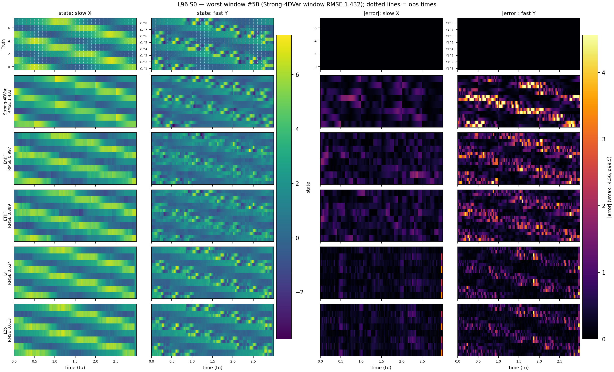
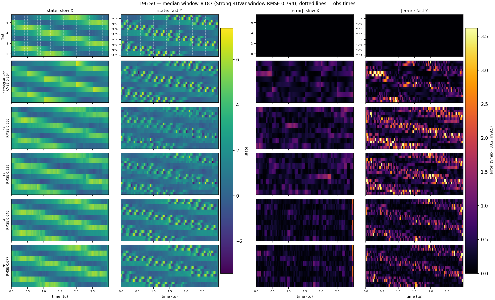
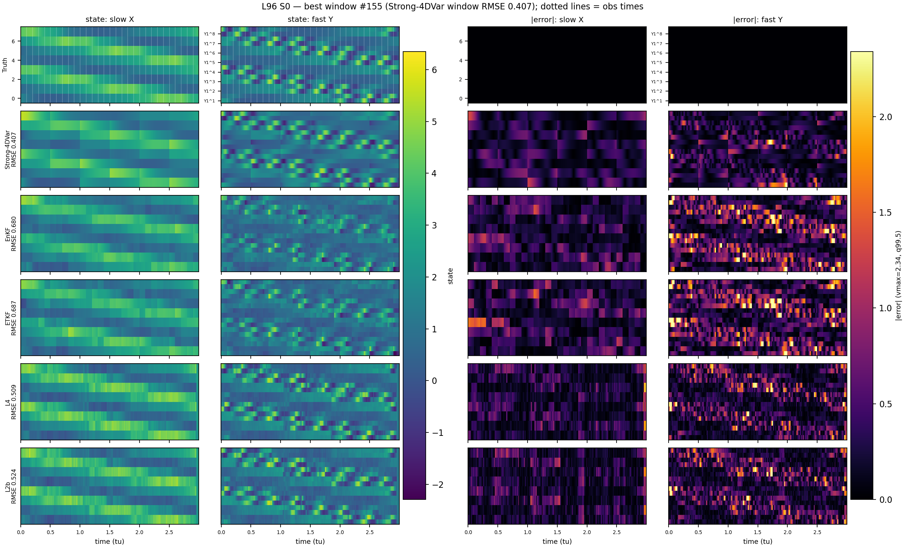
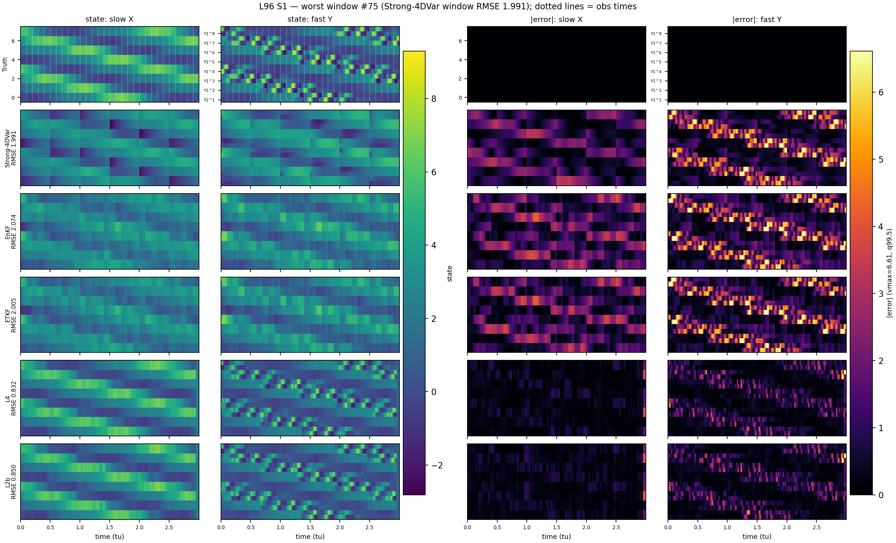
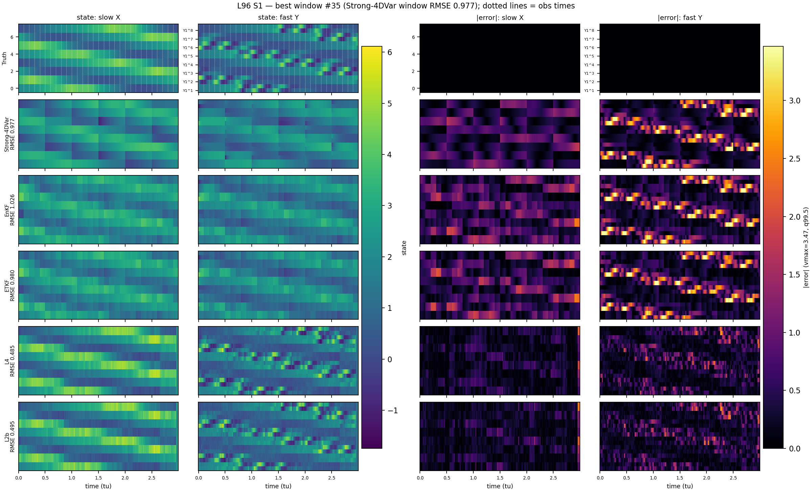

# L96 Consolidated Benchmark — DA baselines vs neural models

Setup: two-scale L96, Obs30 (`obs_interval=100`, `obs_j=2` → 24D observed space), dws=500, 200 shared cached test windows; S1 = ±20% params + ±10% bias (DA forward model uses biased `*_da`).

RMSE/EV are recomputed from the stored trajectory arrays via `evaluation/estimate_metrics.py`; ES for DA ensemble methods (EnKF/ETKF) and L3 (ens30×10) are proper ensemble scores (N=30, MAE − 0.5·pairwise spread) read from cached run outputs; ES for deterministic methods is the N=1 per-dim MAE proxy. **bold** marks the best value per column.

## Benchmarked schemes

| ID | Type | Description |
|---|---|---|
| Strong-4DVar | Variational | Strong-constraint 4D-Var over the dws=500 window (`B_var=2.0`, `R_var=0.5`, `max_iter=10`, `lr=0.2`, autodiff minimization); assimilates the full window trajectory. |
| EnKF | Ensemble KF | Stochastic ensemble Kalman filter, `N_ens=30`, inflation=2.0, no localization; sequential observation updates. |
| ETKF | Ensemble KF | Deterministic ensemble square-root filter, `N_ens=30`, inflation=2.0, no localization. |
| L1b | Neural (DirectUNet) | Single-pass regression obs → state, hidden [64,128,256]; obs-only conditioning; 200 epochs. |
| L2b | Neural (CFM, τ=0) | Conditional flow matching trained at τ=0 only; sampled with a single Euler step (deterministic, conditional-mean-like); hidden [64,128,256]; 400 epochs. |
| L3 | Neural (CFM, multi-τ) | Standard multi-τ CFM training; evaluated as a 30-member ensemble with 10 Euler steps (`ens30×10`, N=30, deterministic τ-schedule 0→1, fresh x₀ per member); hidden [64,128,256]; 400 epochs. |
| L4 | Neural (DirectUNet) | As L1b with small backbone [32,64,128]. |
| L5 | Neural (CFM, τ=0) | As L2b with small backbone [32,64,128]. |
| L6 | Neural (CFM, τ=0) | As L2b plus corrupted-forcing conditioning (`cond_extra_dim=1`); tests the robustness value of forcing input. |
| V2 | Neural (TweedieCFM) | Two-stage Tweedie CFM: stage-1 MeanEstimatorCell (obs → mean), stage-2 residual velocity UNet; hidden [64,128,256]; 100+400 epochs; multi-τ, **K_inner=1 (kinner1 variant)**; evaluated as a 30-member ensemble with 10 Euler steps (`ens30×10`, N=30); N_outer=10. The V2 row reports the **K_inner=1 ablation** (see the dedicated `l96_tweediecfm_benchmark.md` for the full V2 family). |
| V3 | Neural (PredictStateCFM) | Single-stage CFM predicting the final-state mean μ = E[x₁|x_τ,y]; hidden [64,128,256]; 400 epochs; evaluated as a 30-member ensemble with 10 Euler steps (`ens30×10`, N=30); N_outer=10. |
| SDA1 | Neural (SDA prior + DPS guidance) | Unconditional flow-matching prior p(x₁) -- no obs, params, or forcing conditioning at all, trained on the same S0/S1 mix (`forcing_state_bias=0.1` in train/val, same as every other L-series/V2/V3 config); hidden [64,128,256]; 400 epochs. State estimated at inference time only, via DPS/Pi-GDM-style observation guidance (normalized-gradient step on the Tweedie posterior-mean estimate, `evaluation/sda_sampler.py`) with N_outer=10 Euler steps, guidance_weight=40 (picked by an S0 RMSE sweep over {0.3..400}), R_var=0.5 (matches `data.R_var`); evaluated as a 30-member ensemble (fresh x₀ per member, `ens30×10`, N=30), same convention as L3/V2/V3. |
| SDA2-mixed | Neural (SDA prior, params+forcing cond. + DPS guidance) | As SDA1 but the prior is additionally conditioned on the per-window physical params (F, c1, hx, eps, w1-w4) and the corrupted forcing signal (`ConditionalPriorCFM`, `models/sda.py`) -- obs is still never a network input, only the guidance term at inference conditions on it. Trained on the identical S0/S1 mix as SDA1 (`forcing_state_bias=0.1`); hidden [64,128,256]; 400 epochs; guidance_weight=40, N_outer=10, R_var=0.5; evaluated as a 30-member ensemble (`ens30×10`, N=30). |
| SDA2-nominal | Neural (SDA prior, params+forcing cond., nominal-only train) | Identical architecture/inference to SDA2-mixed but trained with `forcing_state_bias=0.0` (genuinely nominal-only train/val -- never sees the S1-level forcing corruption at training time, unlike every other row in this table); hidden [64,128,256]; 400 epochs; guidance_weight=40, N_outer=10, R_var=0.5; evaluated as a 30-member ensemble (`ens30×10`, N=30). Tests whether the amortized S1/S0 resilience seen elsewhere in this table survives when training-time exposure to model error is removed entirely. |
| FDV1 | Neural (4DVarNet-style unrolled solver) | Unrolled solver: the update at each of N_outer=10 iterations is the output of a weight-tied UNet1D fed `concat(state, obs)` (`update_input='obs+state'`, no gradient/cost term at all -- see `models/fourdvarnet.py::FourDVarNetSolver`), `x_{k+1} = x_k - (1/N_outer)*UNet(x_k, obs)`, zero-initialized; hidden [64,128,256]; 400 epochs; loss = final-iteration MSE only. Fully deterministic (no ensemble, no randomness anywhere) -- evaluated as a single pass (N=1), same convention as Strong-4DVar/L1b/L2b. Design taxonomy (`update_input` string) traced to CIA-Oceanix/4dvarnet-global-mapping's `ronan_devs` branch (`GradSolver_withStep`); gradient-conditioned modes (`grad-only`/`grad+state`/`subgrad+state`) reserved for a future FDV2. |
| FDV1CFM | Neural (4DVarNet-CFM, PredictStateCFM + FDV1 backbone) | V3 (`PredictStateCFM`) CFM parameterization -- predicts μ = E[x1|x_τ,y] at a randomly-sampled outer flow-time τ, trained via MSE(μ,x1), sampled by forward ODE integration `x += dt*(μ-x)/(1-τ)` over N_outer=10 steps -- but μ is computed by FDV1's own K_inner=5-step weight-tied unrolled `obs+state` refinement (`models/fourdvarnet.py::FourDVarNetPredictStateCFM`), started from the current x_τ, instead of a single UNet1D forward pass as plain V3 uses. Total NFE per sample = N_outer×K_inner = 50 (5x V3's 10, 5x FDV1's 10). hidden [64,128,256]; 400 epochs, single random τ per training batch (cheaper to train than FDV1 itself, which backprops through its full 10-step unroll every batch). A rare (~1-in-several-thousand ens30 samples) divergence of the inner unroll on out-of-distribution x_τ is guarded with a `clip_range=50.0` clamp after each inner step (same convention as this codebase's L96/QG dynamics integrators) -- inactive for in-distribution trajectories (|x|<10). Evaluated as a 30-member ensemble with 10 Euler steps (`ens30×10`, N=30). |
| FDV1+SDA1 | Neural (FDV1 mean + SDA1 warm-started guidance) | No retraining: FDV1's frozen point estimate warm-starts SDA1's guided sampling trajectory (`evaluation/sda_sampler.py`'s `mean_estimate`/`tau0`, a "SDEdit"-style warm start -- `x_τ0 = (1-τ0)·noise + τ0·FDV1_estimate`, Euler-integrated only from τ0 to 1) instead of starting from pure noise; `guided_obs_cost`/the Tweedie x_hat_1 machinery are unchanged. Hyperparameters (`tau0=0.7`, `guidance_weight=2`) picked by an S0-only grid sweep over `tau0∈{0,0.3,0.5,0.7,0.8}×guidance_weight∈{0,1,2,5,10,40,100}` -- any guidance stronger than ~2 actively hurts once warm-started (the DPS step size calibrated for pure-noise starts is too aggressive here); evaluated as a 30-member ensemble (`ens30×10`, N=30). |
| FDV1+SDA2 | Neural (FDV1 mean + SDA2-nominal warm-started guidance) | As FDV1+SDA1 but warm-starting SDA2-nominal (params+forcing-conditioned prior) instead of SDA1; `tau0=0.5`, `guidance_weight=2` (own S0-only grid sweep -- SDA2's conditioning makes more remaining Euler steps useful than SDA1's fully-unconditional prior, hence the lower `tau0`); evaluated as a 30-member ensemble (`ens30×10`, N=30). **New best neural scheme in this table on RMSE/EV** (FDV1CFM above still has the best ES). |
| FDV1+FDV1CFM | Neural (FDV1 mean + FDV1-CFM warm-started sampling) | No retraining: FDV1's frozen point estimate warm-starts FDV1-CFM's own sampling trajectory via the same `mean_estimate`/`tau0` SDEdit-style mechanism as the FDV1+SDA hybrids (`models/fourdvarnet.py::FourDVarNetPredictStateCFM.sample`) -- `x_τ0 = (1-τ0)·noise + τ0·FDV1_estimate`, Euler-integrated only from τ0 to 1. A literal τ0=0 warm start (recentering the τ=0 noise on FDV1's estimate, still running the full N_outer steps) was tried first and made things *worse* (single-sample RMSE 0.897 vs. 0.555 unwarm-started): CFM training pairs τ=0 with near-zero-magnitude noise only, so injecting a real-state-scale mean there is an out-of-training-distribution (τ, |x_τ|) combination that confuses the first refinement step, and that confusion compounds since no steps are skipped. `tau0=0.7` (picked by an S0-only sweep over `tau0∈{0,0.2,...,0.9}`, single-sample RMSE, plateauing over `tau0∈[0.6,0.8]`) avoids this the same way the FDV1+SDA hybrids do. Evaluated as a 30-member ensemble (`ens30×10`, N=30); no clamp activations observed in this evaluation (unlike FDV1CFM alone) since the shorter, better-anchored trajectory has much less room to diverge. |

Shared setup: all L-series neural models are trained and evaluated on the identical DA-parity benchmark (all-5 params ±20% randomized per window; S1 adds a ±10% bias; models operate in the 24D observed subspace with obs-only inputs unless noted). DA baselines receive the same per-window parameters as the truth generation (S0) or their biased `*_da` counterparts (S1), which is what makes the DA-vs-neural comparison apples-to-apples.

## RMSE (pooled, lower is better)

### RMSE by variable group

| Method | S0 all | S0 slow | S0 fast | S1 all | S1 slow | S1 fast | S1/S0 |
|---|---|---|---|---|---|---|---|
| ETKF | 0.8883 | 0.4749 | 1.0950 | 1.4998 | 1.2394 | 1.6299 | 1.688 |
| EnKF | 0.9131 | 0.4974 | 1.1210 | 1.5381 | 1.2490 | 1.6826 | 1.684 |
| Strong-4DVar | 0.8116 | 0.4683 | 0.9833 | 1.4617 | 1.0760 | 1.6546 | 1.801 |
| L1b | 0.6221 | 0.4019 | 0.7321 | 0.6256 | 0.4006 | 0.7381 | 1.006 |
| L2b | 0.6330 | 0.4188 | 0.7401 | 0.6336 | 0.4154 | 0.7426 | 1.001 |
| L3 | 0.5645 | 0.3325 | 0.6804 | 0.5668 | 0.3347 | 0.6829 | 1.004 |
| L4 | 0.6189 | 0.4037 | 0.7265 | 0.6211 | 0.4024 | 0.7304 | 1.004 |
| L5 | 0.6603 | 0.4858 | 0.7476 | 0.6604 | 0.4831 | 0.7490 | 1.000 |
| L6 | 0.6390 | 0.4136 | 0.7517 | 0.6381 | 0.4097 | 0.7523 | 0.999 |
| V2 | 0.5098 | 0.2637 | 0.6329 | 0.5154 | 0.2641 | 0.6410 | 1.011 |
| V3 | 0.5716 | 0.3437 | 0.6856 | 0.5729 | 0.3424 | 0.6881 | 1.002 |
| SDA1 | 0.7187 | 0.4432 | 0.8564 | 0.7169 | 0.4387 | 0.8560 | 0.998 |
| SDA2-mixed | 0.7076 | 0.3864 | 0.8682 | 0.7052 | 0.3804 | 0.8676 | 0.997 |
| SDA2-nominal | 0.7047 | 0.3802 | 0.8670 | 0.7035 | 0.3764 | 0.8671 | 0.998 |
| FDV1 | 0.4700 | 0.2429 | 0.5836 | 0.4704 | 0.2414 | 0.5849 | 1.001 |
| FDV1CFM | 0.4965 | 0.2461 | 0.6217 | 0.4954 | 0.2413 | 0.6225 | 0.998 |
| FDV1+SDA1 | 0.4653 | 0.2381 | 0.5790 | 0.4659 | 0.2370 | 0.5804 | 1.001 |
| FDV1+SDA2 | **0.4514** | **0.2142** | **0.5700** | **0.4521** | **0.2128** | **0.5717** | 1.002 |
| FDV1+FDV1CFM | 0.4625 | 0.2371 | 0.5753 | 0.4630 | 0.2360 | 0.5765 | 1.001 |

Note on conventions: the DA metric cache stores the **mean of per-window RMSEs** (evaluation/run_l96.py), while this table uses the **pooled** convention (`sqrt(mean sq err)` over all windows/timesteps) for every method — the same convention as the neural evaluation. Pooled RMSE is ≤ mean-of-window RMSE, so DA values here are slightly lower (more favorable) than in the legacy cache; both orderings agree.

## Explained Variance (higher is better)

### EV by variable group

| Method | S0 all | S0 slow | S0 fast | S1 all | S1 slow | S1 fast |
|---|---|---|---|---|---|---|
| ETKF | 0.6915 | 0.9395 | 0.5676 | 0.2149 | 0.5772 | 0.0338 |
| EnKF | 0.6758 | 0.9337 | 0.5469 | 0.1717 | 0.5706 | -0.0278 |
| Strong-4DVar | 0.7478 | 0.9412 | 0.6510 | 0.2330 | 0.6813 | 0.0089 |
| L1b | 0.8567 | 0.9567 | 0.8067 | 0.8538 | 0.9558 | 0.8028 |
| L2b | 0.8527 | 0.9530 | 0.8025 | 0.8510 | 0.9525 | 0.8003 |
| L3 | 0.8787 | 0.9703 | 0.8330 | 0.8770 | 0.9691 | 0.8310 |
| L4 | 0.8586 | 0.9563 | 0.8097 | 0.8564 | 0.9554 | 0.8068 |
| L5 | 0.8445 | 0.9364 | 0.7985 | 0.8430 | 0.9354 | 0.7969 |
| L6 | 0.8489 | 0.9541 | 0.7963 | 0.8480 | 0.9538 | 0.7951 |
| V2 | 0.8975 | 0.9813 | 0.8556 | 0.8944 | 0.9808 | 0.8511 |
| V3 | 0.8764 | 0.9683 | 0.8305 | 0.8748 | 0.9677 | 0.8284 |
| SDA1 | 0.8061 | 0.9473 | 0.7355 | 0.8054 | 0.9470 | 0.7347 |
| SDA2-mixed | 0.8054 | 0.9600 | 0.7282 | 0.8049 | 0.9602 | 0.7273 |
| SDA2-nominal | 0.8063 | 0.9612 | 0.7289 | 0.8055 | 0.9610 | 0.7278 |
| FDV1 | 0.9128 | 0.9842 | 0.8772 | 0.9121 | 0.9840 | 0.8761 |
| FDV1CFM | 0.9015 | 0.9837 | 0.8603 | 0.9009 | 0.9840 | 0.8594 |
| FDV1+SDA1 | 0.9143 | 0.9848 | 0.8791 | 0.9135 | 0.9845 | 0.8780 |
| FDV1+SDA2 | **0.9178** | **0.9877** | **0.8828** | **0.9169** | **0.9875** | **0.8816** |
| FDV1+FDV1CFM | 0.9154 | 0.9849 | 0.8807 | 0.9147 | 0.9847 | 0.8796 |

## Energy Score (lower is better)

### ES by variable group

| Method | S0 all | S0 slow | S0 fast | S1 all | S1 slow | S1 fast |
|---|---|---|---|---|---|---|
| ETKF | 0.4548 | 0.2857 | 0.5393 | 0.8511 | 0.7626 | 0.8953 |
| EnKF | 0.4599 | 0.2915 | 0.5440 | 0.9018 | 0.7942 | 0.9556 |
| Strong-4DVar | 0.4850* | 0.3551* | 0.5499* | 0.9892* | 0.8197* | 1.0740* |
| L1b | 0.3914* | 0.2704* | 0.4520* | 0.3949* | 0.2702* | 0.4572* |
| L2b | 0.4056* | 0.2867* | 0.4650* | 0.4069* | 0.2850* | 0.4679* |
| L3 | 0.2649 | 0.1749 | 0.3099 | 0.2671 | 0.1773 | 0.3120 |
| L4 | 0.3915* | 0.2726* | 0.4509* | 0.3940* | 0.2725* | 0.4548* |
| L5 | 0.4321* | 0.3525* | 0.4720* | 0.4329* | 0.3507* | 0.4740* |
| L6 | 0.4068* | 0.2814* | 0.4695* | 0.4071* | 0.2803* | 0.4706* |
| V2 | 0.2438 | 0.1513 | 0.2900 | 0.2471 | 0.1516 | 0.2949 |
| V3 | 0.2762 | 0.1884 | 0.3201 | 0.2766 | 0.1871 | 0.3214 |
| SDA1 | 0.3570 | 0.2362 | 0.4175 | 0.3568 | 0.2329 | 0.4187 |
| SDA2-mixed | 0.3299 | 0.1990 | 0.3953 | 0.3283 | 0.1949 | 0.3950 |
| SDA2-nominal | 0.3332 | 0.1975 | 0.4011 | 0.3322 | 0.1938 | 0.4015 |
| FDV1 | 0.2889* | 0.1830* | 0.3418* | 0.2896* | 0.1818* | 0.3435* |
| FDV1CFM | **0.2332** | 0.1423 | **0.2787** | **0.2328** | 0.1390 | **0.2796** |
| FDV1+SDA1 | 0.2630 | 0.1600 | 0.3146 | 0.2638 | 0.1590 | 0.3162 |
| FDV1+SDA2 | 0.2447 | **0.1376** | 0.2982 | 0.2453 | **0.1360** | 0.3000 |
| FDV1+FDV1CFM | 0.2626 | 0.1609 | 0.3134 | 0.2635 | 0.1602 | 0.3151 |

`*` = ES from a one-member ensemble (N=1, deterministic; ES = per-dim MAE). Unmarked = proper ensemble ES (N=30, MAE − 0.5·pairwise spread). EnKF/ETKF ES are read from the bug-fixed DA cache; L3 ES from the ens30×10 run; Strong-4DVar and other neural models are deterministic (N=1).

## Consistency checks

- DA cached metrics vs recomputed-from-npz (42 values): max |Δ| = 2.16e-04 → PASS
- Neural stored truth vs dataset true_state[:, obs_var_indices]: max |Δ| = 0.00e+00 → PASS

## Reconstruction examples (Hovmöller)

Windows ranked by per-window pooled 24D RMSE of Strong-4DVar (best DA scheme); each figure shows rows = Truth/methods and columns = state / |error| maps for the slow X (8D) and fast Y (16D) blocks. State colors share one scale per figure; error maps share one scale across all rows/methods (99.5th-percentile cap, noted on the colorbar). Dotted vertical lines on the truth row mark observation times.

| Case | Rank | Window | 4DVar win-RMSE | Strong-4DVar | EnKF | ETKF | L4 | L2b |
|---|---|---|---|---|---|---|---|---|
| S0 | worst | 58 | 1.432 | 1.432 | 0.997 | 0.889 | 0.624 | 0.613 |
| S0 | median | 187 | 0.794 | 0.794 | 0.995 | 0.939 | 0.640 | 0.677 |
| S0 | best | 155 | 0.407 | 0.407 | 0.680 | 0.687 | 0.509 | 0.524 |
| S1 | worst | 75 | 1.991 | 1.991 | 2.074 | 2.005 | 0.832 | 0.850 |
| S1 | median | 198 | 1.482 | 1.482 | 1.529 | 1.507 | 0.615 | 0.624 |
| S1 | best | 35 | 0.977 | 0.977 | 1.026 | 0.980 | 0.485 | 0.495 |

