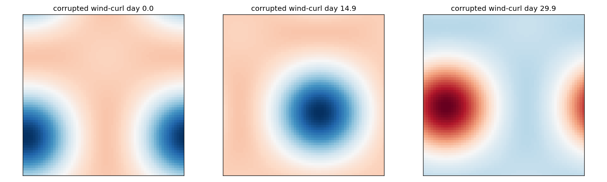
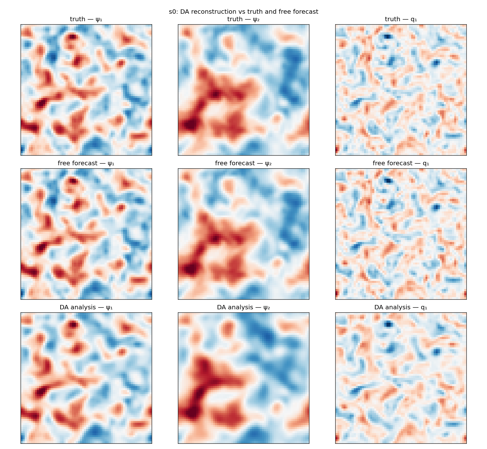
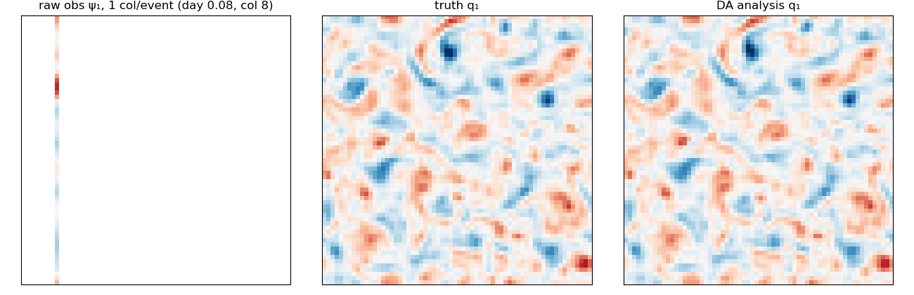
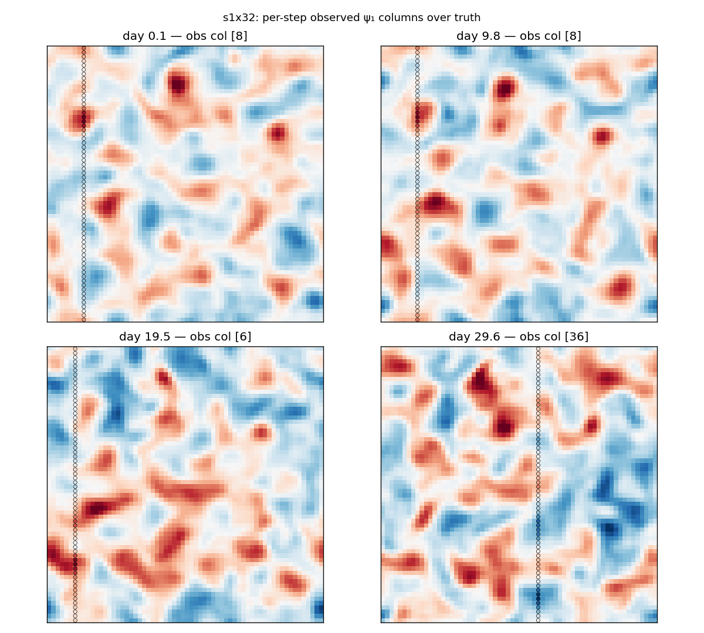
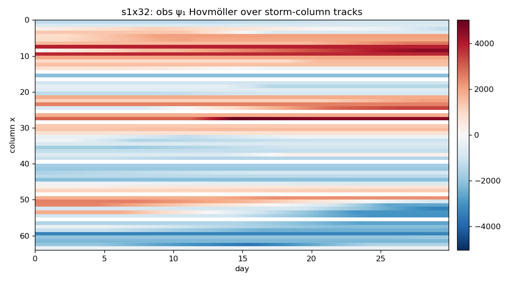
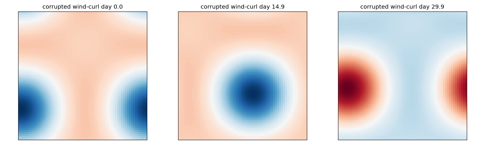
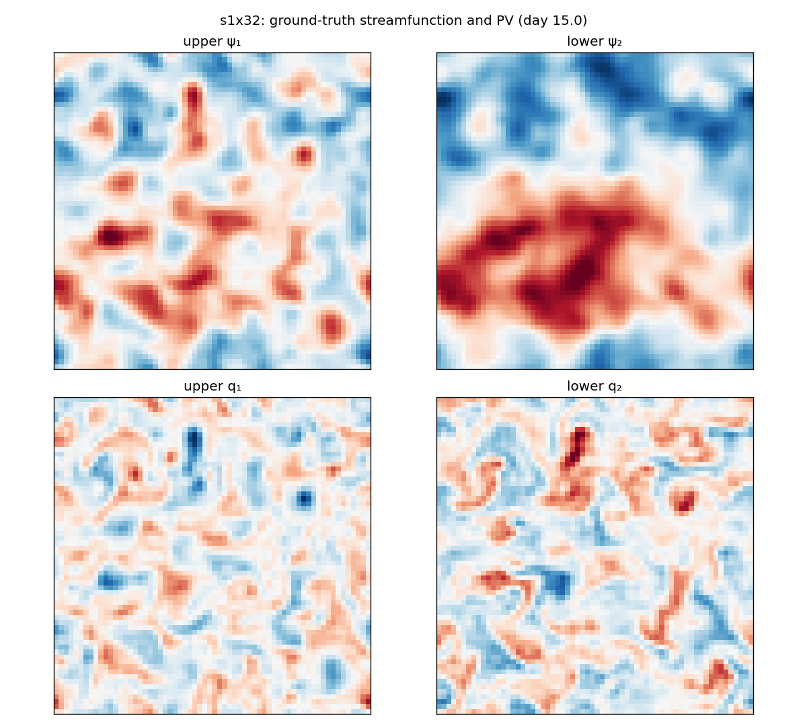
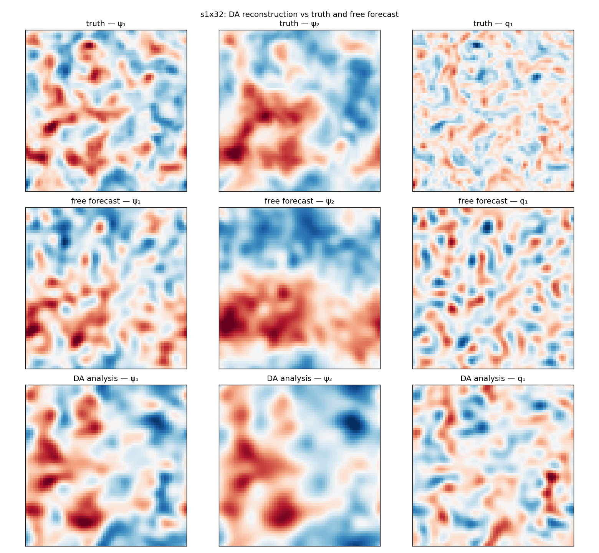
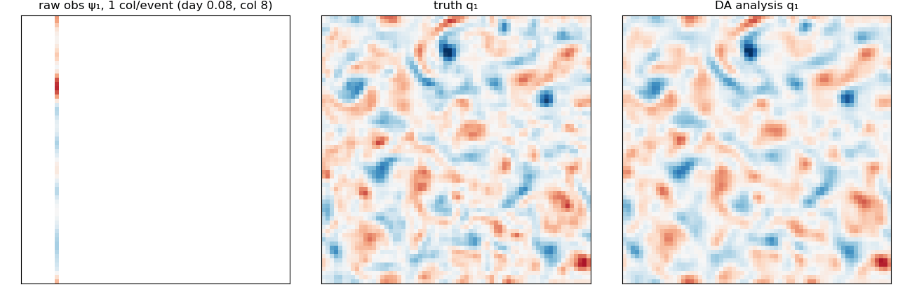

# QG DA Baselines — Consolidated Report (psi-obs focus)

**Date:** 2026-09-02 (multi-method + S1 extension: 2026-09-06)
**Branch (report):** master
**Scope:** psi-obs configurations (upper-layer streamfunction) only; S0 (error-free), S1-QG2L (param + forcing + cross-resolution error) and S1-QG1L (structural 1-layer error).
**Provenance (jobs, A40 `sl-mee-br-205`):** S0 1%-noise matrix (`qg_matrix_c{4,8}_psi`, lags 1/2); S1 @ da_nx=16 (`qg_s1`), da_nx=32 (`qg_s1_da32`), da_nx=64 (`qg_s1_nores`, lag 1.0); S1-QG1L r-scale probe (`qg_s1_qg1l_rscale`); S1 cross-res 4-method (`qg_s1_da32_4method`) and S1-QG1L 4-method (`qg_s1_qg1l_4method`), both job 52169/52090.

**Obs-protocol reproducibility note (2026-09-06):** PR #156 changed the random-columns obs geometry (per-column independent intra-day timing vs the older constellation-style simultaneous-column events the §4.1/§4.2 S0 matrix and most of §5's da_nx=16/64 numbers below were archived under). Re-running the exact S0 reference case (cols=4, lag=1.0) under current `origin/master` gives small shifts, no qualitative change -- ETKF 1.16->1.14/EV 0.752->0.747, EnKF 1.17->1.16/EV 0.754->0.749, Strong-4DVar 1.33->1.44/EV 0.725->0.773, Weak-4DVar 1.43->1.50/EV 0.788->0.805 (`reports/qg/outputs/qg_repro_validation/`, job 52174; see PLAN.md for detail). The da_nx=32 and QG1L sections (§5.7, §6.4) below were generated fresh under the current geometry, so need no such caveat.

## 1. System and governing equations

### 1.1 Two-layer quasi-geostrophic (Philips) model

The truth dynamics are the two-layer Phillips-channel QG equations
(double-periodic β-plane) solved by `QGDynamics` (native torch port of pyqg
v0.4.0, flux-form advection, `-J(ψ, q)`). Potential vorticity and evolution:

$$ q_1 = \nabla^2 \psi_1 + F_1(\psi_2 - \psi_1), \qquad
    q_2 = \nabla^2 \psi_2 + F_2(\psi_1 - \psi_2) $$

$$ \frac{d q_1}{dt} = -J(\psi_1,\, q_1) - Q_{y1}\,\partial_x \psi_1
    + \mathrm{curl}\,\tau $$

$$ \frac{d q_2}{dt} = -J(\psi_2,\, q_2) - Q_{y2}\,\partial_x \psi_2
    + r_{\mathrm{ek}}\,\nabla^2 \psi_2 $$

with the PV gradients and layer Froude numbers

$$ Q_{y1} = \beta + F_1\,(U_1 - U_2), \qquad
    Q_{y2} = \beta - F_2\,(U_1 - U_2), \qquad
    F_1 = \frac{r_d^{-2}}{1+\delta}, \qquad
    F_2 = \delta\, F_1 . $$

Here $\beta$ is the planetary vorticity gradient, $r_d$ the deformation
radius, $\delta$ the layer-depth ratio and $U_1,U_2$ the imposed mean zonal
flows. Time stepping is RK4 with the pyqg exponential spectral filter applied
once per step. State layout is flattened `[2·ny·nx]` (layer-major).

### 1.2 Wind forcing (upper-layer PV source)

A moving-storm wind-stress curl $\mathrm{curl}\,\tau$ drives the upper-layer
PV. It is a localized Gaussian storm (Witch-of-Agnesi profile) whose centre
follows a storm track $x_c(t) = x_0 + c_x t + w_x(t)$ (mod $L$),
$y_c(t) = y_0 + c_y t + w_y(t)$ (mod $W$) with OU position jitter
$w_x,w_y$ and OU amplitude $A(t)$ (`wind_amp`). For each window the storm
start, track drift and amplitude are randomized (see case-study table).

### 1.3 Reduced-gravity single-layer model (S1-QG1L)

The structural-error DA model is a reduced-gravity 1-layer QG (`QG1LDynamics`):
one active upper layer over a motionless deep layer,

$$ q = \nabla^2 \psi - \frac{\psi}{r_d^2}, \qquad
    \psi = -\left(\nabla^2 + r_d^{-2}\right)^{-1} q $$

$$ \frac{d q}{dt} = -J(\psi,\, q + \beta y) - r_{\mathrm{ek}}\,\nabla^2 \psi
    + \mathrm{curl}\,\tau . $$

`param_names = [β, rd, rek, U1]`. The truth remains the two-layer model; the
DA filter uses the single-layer PV structure as a mistaken forecast model.

## 2. Case studies

The observation configuration is **psi-obs** (upper-layer streamfunction at random meridional columns, 1% obs noise) throughout. Three case studies are benchmarked:

| Config | Dynamics / DA model | Observed field | Obs geometry | Model error | DA resolution |
|---|---|---|---|---|---|
| **S0** | truth = 2-layer QG; DA = `qg2l` (exact) | upper-layer ψ (psi-obs) | random columns, `cols_per_day` ∈ {4, 8} | none (error-free; obs noise only 1%) | full res (da_nx = nx = 64) |
| **S1-QG2L** | truth = 2-layer QG; DA = `qg2l_lores` (2-layer, honest) | upper-layer ψ (psi-obs) | random columns, `cols_per_day` = 4 | param bias (`rd,rek` ×0.85) + corrupted wind (OU jitter + amplitude bias) + cross-resolution da_nx ∈ {16, 32, 64} | da_nx = 16 / 32 / 64 |
| **S1-QG1L** | truth = 2-layer QG; DA = `qg1l` (reduced-gravity 1-layer) | upper-layer ψ (psi-obs; q-obs reference) | random columns, `cols_per_day` = 4 | structural error (1-layer vs 2-layer mismatch); `obs_var_r_scale` ∈ {1, 100, 1e4} | full res (da_nx = 64) |

Observed field is the upper-layer streamfunction ψ₁ for every configuration
(psi-obs; the `ObsOperator` inverts ψ to PV after spectral upsampling on the
DA grid). The q-obs (upper-layer PV) runs are included only as local-VP
reference in the QG1L section. All scenarios share the ETKF (N = 80,
inflation 1.0, Gaspari–Cohn localization radius 6) and lagged-truth
initialization (lags 1.0 and 2.0 d in S0/S1-QG2L; 1.0 d in S1-QG1L).

## 3. Base configuration

### 3.1 QGConfig snapshot

| Parameter | Value |
|---|---|
| Domain length L | 1000000 m |
| Grid | nx = ny = 64, state_dim = 8192 (2×64×64, layer-major) |
| Time step | dt = 7200 s, steps_per_day = 12 |
| Assimilation window | 30 days (360 steps) |
| Spinup | 2 years |
| Windows | 5 |
| Physics β | 1.5e-11 |
| Physics rd | 15000 m |
| Physics δ (layer-depth ratio) | 0.25 |
| Physics U₁ | 0.05 |
| Physics U₂ | 0.0 |
| Physics rek (linear drag) | 5.787e-07 |
| Spectral filter | filterfac = 23.6 |
| Seed | 7 |

### 3.2 Moving-storm wind forcing (upper-layer PV source)

- Wind-stress-curl amplitude `wind_amp = 1e-11` (Ornstein–Uhlenbeck, `wind_tau_days = 15` d; storm width `wind_sigma = 250` km).
- Storm-track drift `wind_cx = 0.5`, `wind_cy = 0.03` m/s; position OU jitter `wind_drift_tau_days = 10` d, `wind_drift_sigma = 50` km.

### 3.3 Per-window truth randomization

- U₁, rd, rek drawn once per window as `U[1 ± param_range]` (`param_range = 0.15`); β/δ fixed.
- Independent storm per window: start `(x0,y0) ~ U(0,L)²`, track `cx ~ U[0.25, 0.75]`, `cy ~ U[−0.06, 0.06]`.
- Wind amplitude drawn from discrete levels `{0, 3e-12, 1e-11, 2e-11, 3e-11}` round-robin `i % 5`.
- Initial state at `t₀ − U(0, init_lag_days)` (lagged-truth first guess).

### 3.4 Observations

- Geometry `random_columns`: `cols_per_day` distinct meridional columns of the upper-layer field, each observed exactly once per day at its own randomly-sampled intra-day step (no two columns of a day share a step).
- Observed field: upper-layer streamfunction ψ₁ (psi-obs) — the baseline `ObsOperator` inverts ψ to PV after spectral upsampling on the DA grid.
- Noise: `sigma = obs_noise_std_frac × std(field)`, `frac = 0.01` (1%).
- Coverage (production): cols = 4 → ~0.52% of space-time gridpoints.

### 3.5 DA filter

- **ETKF**, ensemble N = 80, inflation 1.0, Gaspari–Cohn localization radius 6 (physical coords on the DA grid).
- Init: lagged-truth shared by the DA ensemble and the free-forecast reference; `disp_frac = 1.0` (background-error-scaled), band ±0.25 d.
- Lags: 1.0 d and 2.0 d (S0, S1-QG2L); 1.0 d (S1-QG1L).

## 4. S0 metrics (error-free, psi-obs)

Error-free benchmark: `da_params = true_params`, DA at full resolution (`da_nx = nx = 64`). psi-obs matrix, cols ∈ {4, 8}, lags 1.0/2.0, 1% noise. RMSE on the upper-layer ψ field; `improv` = forecast improvement (DA-RMSE / free-RMSE, >1 means the DA beats the free forecast); EV = pooled explained variance.

### 4.1 Headline (psi-obs)

| method | obs | cols | lag | DA RMSE | Free RMSE | improv | EV_full | EV_free |
|---|---|---|---|---|---|---|---|---|
| etkf | psi | 4 | 1.0 | 6.40e-06 | 7.33e-06 | 1.14 | +0.747 | +0.727 |
| enkf | psi | 4 | 1.0 | 6.28e-06 | 7.33e-06 | 1.17 | +0.754 | +0.727 |
| strong4dvar | psi | 4 | 1.0 | 5.50e-06 | 7.33e-06 | 1.33 | +0.725 | +0.727 |
| weak4dvar | psi | 4 | 1.0 | 5.12e-06 | 7.33e-06 | 1.43 | +0.788 | +0.727 |
| etkf | psi | 4 | 2.0 | 8.30e-06 | 1.30e-05 | 1.57 | +0.639 | +0.301 |
| enkf | psi | 4 | 2.0 | 8.08e-06 | 1.30e-05 | 1.61 | +0.655 | +0.301 |
| strong4dvar | psi | 4 | 2.0 | 9.08e-06 | 1.30e-05 | 1.43 | +0.322 | +0.301 |
| weak4dvar | psi | 4 | 2.0 | 9.04e-06 | 1.30e-05 | 1.44 | +0.370 | +0.301 |
| etkf | psi | 8 | 1.0 | 4.78e-06 | 7.33e-06 | 1.53 | +0.812 | +0.727 |
| etkf | psi | 8 | 2.0 | 6.94e-06 | 1.30e-05 | 1.88 | +0.684 | +0.301 |

### 4.2 Per-field (psi-obs, cols=4, lag 1.0)

**etkf**

| field | layer | DA RMSE | Free RMSE | improv | EV | EV_free |
|---|---|---|---|---|---|---|
| PV q | upper (layer 1) | 1.09e-05 | 1.37e-05 | 1.26 | +0.815 | +0.706 |
| PV q | lower (layer 2) | 2.21e-06 | 1.96e-06 | 0.89 | +0.679 | +0.748 |
| PV q | full state | 7.84e-06 | 9.76e-06 | 1.24 | +0.747 | +0.727 |
| streamfunction ψ | upper (layer 1) | 2.57e+03 | 2.57e+03 | 1.00 | +0.966 | +0.967 |
| streamfunction ψ | lower (layer 2) | 1.95e+03 | 1.11e+03 | 0.57 | +0.972 | +0.991 |
| streamfunction ψ | full state | 2.28e+03 | 1.98e+03 | 0.87 | +0.969 | +0.979 |

**enkf**

| field | layer | DA RMSE | Free RMSE | improv | EV | EV_free |
|---|---|---|---|---|---|---|
| PV q | upper (layer 1) | 1.09e-05 | 1.37e-05 | 1.26 | +0.816 | +0.706 |
| PV q | lower (layer 2) | 2.18e-06 | 1.96e-06 | 0.90 | +0.691 | +0.748 |
| PV q | full state | 7.84e-06 | 9.76e-06 | 1.25 | +0.754 | +0.727 |
| streamfunction ψ | upper (layer 1) | 2.53e+03 | 2.57e+03 | 1.02 | +0.967 | +0.967 |
| streamfunction ψ | lower (layer 2) | 1.9e+03 | 1.11e+03 | 0.58 | +0.972 | +0.991 |
| streamfunction ψ | full state | 2.24e+03 | 1.98e+03 | 0.88 | +0.970 | +0.979 |

**strong4dvar**

| field | layer | DA RMSE | Free RMSE | improv | EV | EV_free |
|---|---|---|---|---|---|---|
| PV q | upper (layer 1) | 1.00e-05 | 1.37e-05 | 1.36 | +0.839 | +0.706 |
| PV q | lower (layer 2) | 2.37e-06 | 1.96e-06 | 0.83 | +0.611 | +0.748 |
| PV q | full state | 7.29e-06 | 9.76e-06 | 1.34 | +0.725 | +0.727 |
| streamfunction ψ | upper (layer 1) | 1.43e+03 | 2.57e+03 | 1.80 | +0.990 | +0.967 |
| streamfunction ψ | lower (layer 2) | 987 | 1.11e+03 | 1.12 | +0.993 | +0.991 |
| streamfunction ψ | full state | 1.23e+03 | 1.98e+03 | 1.61 | +0.991 | +0.979 |

**weak4dvar**

| field | layer | DA RMSE | Free RMSE | improv | EV | EV_free |
|---|---|---|---|---|---|---|
| PV q | upper (layer 1) | 9.10e-06 | 1.37e-05 | 1.50 | +0.868 | +0.706 |
| PV q | lower (layer 2) | 2.06e-06 | 1.96e-06 | 0.95 | +0.708 | +0.748 |
| PV q | full state | 6.60e-06 | 9.76e-06 | 1.48 | +0.788 | +0.727 |
| streamfunction ψ | upper (layer 1) | 1.36e+03 | 2.57e+03 | 1.90 | +0.991 | +0.967 |
| streamfunction ψ | lower (layer 2) | 972 | 1.11e+03 | 1.14 | +0.993 | +0.991 |
| streamfunction ψ | full state | 1.18e+03 | 1.98e+03 | 1.68 | +0.992 | +0.979 |

## 5. S1-QG2L metrics (param + forcing + cross-resolution error)

Model-error S1 with the **2-layer** DA model (`qg2l_lores`): parameter bias (`rd,rek ← rd,rek × 0.85`) + corrupted wind (OU location jitter + amplitude bias) + cross-resolution da_nx. Ternary `da_nx` = cross-resolution ratio vs the 64×64 truth: 16 (4:1), 32 (2:1), 64 (1:1, no resolution mismatch). psi-obs, cols = 4, 1% noise.

### 5.1 Headline across da_nx (psi-obs, cols=4, lag 1.0)

| da_nx | ratio | DA RMSE | Free RMSE | improv | EV_full | EV_free |
|---|---|---|---|---|---|---|
| 16 | 4:1 | 1.73e-05 | 1.88e-05 | 1.08 | -0.140 | -0.456 |
| 32 | 2:1 | 1.32e-05 | 1.83e-05 | 1.38 | +0.224 | -0.348 |
| 64 | 1:1 | 1.18e-05 | 1.70e-05 | 1.44 | +0.335 | -0.232 |

### 5.2 S1-QG2L lag trend (da_nx=16)

| lag | DA RMSE | Free RMSE | improv | EV_full | EV_free |
|---|---|---|---|---|---|
| 1.0 | 1.73e-05 | 1.88e-05 | 1.08 | -0.140 | -0.456 |
| 2.0 | 1.74e-05 | 1.93e-05 | 1.11 | -0.135 | -0.542 |

### 5.3 Per-field — S1-QG2L @ da_nx=16 (lag 1.0)

| field | layer | DA RMSE | Free RMSE | improv | EV | EV_free |
|---|---|---|---|---|---|---|
| PV q | upper (layer 1) | 2.53e-05 | 2.84e-05 | 1.12 | -0.002 | -0.267 |
| PV q | lower (layer 2) | 4.35e-06 | 4.90e-06 | 1.13 | -0.277 | -0.644 |
| PV q | full state | 1.81e-05 | 2.04e-05 | 1.12 | -0.140 | -0.456 |
| streamfunction ψ | upper (layer 1) | 1.02e+04 | 1.11e+04 | 1.09 | +0.448 | +0.334 |
| streamfunction ψ | lower (layer 2) | 8.09e+03 | 7.88e+03 | 0.97 | +0.483 | +0.502 |
| streamfunction ψ | full state | 9.21e+03 | 9.65e+03 | 1.05 | +0.465 | +0.418 |

### 5.4 Per-field — S1-QG2L @ da_nx=32 (lag 1.0)

| field | layer | DA RMSE | Free RMSE | improv | EV | EV_free |
|---|---|---|---|---|---|---|
| PV q | upper (layer 1) | 2.00e-05 | 2.78e-05 | 1.39 | +0.369 | -0.221 |
| PV q | lower (layer 2) | 3.68e-06 | 4.68e-06 | 1.27 | +0.079 | -0.476 |
| PV q | full state | 1.44e-05 | 1.99e-05 | 1.39 | +0.224 | -0.348 |
| streamfunction ψ | upper (layer 1) | 7.96e+03 | 1.05e+04 | 1.32 | +0.667 | +0.406 |
| streamfunction ψ | lower (layer 2) | 6.8e+03 | 7.96e+03 | 1.17 | +0.646 | +0.493 |
| streamfunction ψ | full state | 7.4e+03 | 9.34e+03 | 1.26 | +0.657 | +0.449 |

### 5.5 Per-field — S1-QG2L @ da_nx=64 (nores) (lag 1.0)

| field | layer | DA RMSE | Free RMSE | improv | EV | EV_free |
|---|---|---|---|---|---|---|
| PV q | upper (layer 1) | 1.80e-05 | 2.68e-05 | 1.49 | +0.483 | -0.155 |
| PV q | lower (layer 2) | 3.47e-06 | 4.37e-06 | 1.26 | +0.187 | -0.310 |
| PV q | full state | 1.30e-05 | 1.92e-05 | 1.48 | +0.335 | -0.232 |
| streamfunction ψ | upper (layer 1) | 1.73e+04 | 1.04e+04 | 0.60 | -0.476 | +0.413 |
| streamfunction ψ | lower (layer 2) | 1.68e+04 | 8.1e+03 | 0.48 | -1.066 | +0.467 |
| streamfunction ψ | full state | 1.71e+04 | 9.33e+03 | 0.55 | -0.771 | +0.440 |

### 5.6 Weak-4DVar on S1 (da_nx=64, nores)

Weak-4DVar (LBFGS w60, q-var-scale=0.1) on the S1 model-error case with the resolution-mismatch component removed (`da_nx=64 == truth`), so the DA model faces only the param bias + corrupted wind. Lags 1.0 and 2.0, psi-obs, cols=4, 1% noise. ETKF (same da_nx=64) shown for reference.

| lag | method | DA RMSE | Free RMSE | improv | EV_full | EV_free |
|---|---|---|---|---|---|---|
| 1.0 | weak4dvar | 8.88e-06 | 1.70e-05 | 1.92 | +0.398 | -0.232 |
| 2.0 | weak4dvar | 1.13e-05 | 1.86e-05 | 1.64 | +0.023 | -0.416 |
| 1.0 | etkf | 1.18e-05 | 1.70e-05 | 1.44 | +0.335 | -0.232 |

### 5.7 Multi-method comparison @ da_nx=32 (psi-obs, cols=4, lag 1.0)

All four DA methods at the cross-resolution S1 case (`da_nx=32`, 2:1 vs the 64x64 truth), same param+wind bias as the rest of S1-QG2L. Strong/Weak-4DVar use the S0-reference hyperparameters (LBFGS, `da_window_steps=60`, `b_var_scale=1.0`[, `q_var_scale=0.1` for weak]) as a first pass, not yet retuned for the cross-res case.

| method | DA RMSE | Free RMSE | improv | EV_full | EV_free |
|---|---|---|---|---|---|
| etkf | 1.24e-05 | 1.83e-05 | 1.47 | +0.340 | -0.348 |
| enkf | 1.24e-05 | 1.83e-05 | 1.48 | +0.342 | -0.348 |
| strong4dvar | 1.47e-05 | 1.83e-05 | 1.25 | -0.935 | -0.348 |
| weak4dvar | 1.32e-05 | 1.83e-05 | 1.39 | -0.235 | -0.348 |

Same pattern as the da_nx=64 (no-res) case, more pronounced: Weak-4DVar clearly beats Strong-4DVar, but neither yet matches ETKF/EnKF here -- cross-resolution adds its own difficulty on top of the bias effect.

## 6. S1-QG1L metrics (structural error, r-scale sweep)

Cross-model structural-error S1: the DA filter uses the **reduced-gravity 1-layer** model (`qg1l`) against the 2-layer truth, at full resolution (da_nx = 64). Under this mismatch the nonlocal psi observations are over-trusted (DA worse than the free forecast, improv ~0.39 at default R). `obs_var_r_scale` inflates the observation-noise variance to model the unmodelled structural error: 1 → 100 → 1e4. psi-obs, cols=4, lag 1.0.

### 6.1 Headline (psi obs, r-scale sweep)

| r_scale | DA RMSE | Free RMSE | improv | EV_full | EV_free |
|---|---|---|---|---|---|
| 1 | 7.49e-05 | 2.93e-05 | 0.39 | -11.220 | -0.496 |
| 100 | 6.91e-05 | 2.93e-05 | 0.42 | -9.782 | -0.496 |
| 10000 | 3.61e-05 | 2.93e-05 | 0.81 | -1.694 | -0.496 |

### 6.2 Per-field (psi obs, r-scale sweep)

**r_scale = 1**

| field | layer | DA RMSE | Free RMSE | improv | EV | EV_free |
|---|---|---|---|---|---|---|
| PV q | upper (layer 1) | 8.64e-05 | 3.13e-05 | 0.36 | -11.220 | -0.496 |
| PV q | full state | 8.64e-05 | 3.13e-05 | 0.36 | -11.220 | -0.496 |
| streamfunction ψ | upper (layer 1) | 1.28e+04 | 5.89e+03 | 0.46 | -6.828 | -0.517 |
| streamfunction ψ | full state | 1.28e+04 | 5.89e+03 | 0.46 | -6.828 | -0.517 |

**r_scale = 100**

| field | layer | DA RMSE | Free RMSE | improv | EV | EV_free |
|---|---|---|---|---|---|---|
| PV q | upper (layer 1) | 8.10e-05 | 3.13e-05 | 0.39 | -9.782 | -0.496 |
| PV q | full state | 8.10e-05 | 3.13e-05 | 0.39 | -9.782 | -0.496 |
| streamfunction ψ | upper (layer 1) | 1.28e+04 | 5.89e+03 | 0.46 | -6.735 | -0.517 |
| streamfunction ψ | full state | 1.28e+04 | 5.89e+03 | 0.46 | -6.735 | -0.517 |

**r_scale = 10000**

| field | layer | DA RMSE | Free RMSE | improv | EV | EV_free |
|---|---|---|---|---|---|---|
| PV q | upper (layer 1) | 4.09e-05 | 3.13e-05 | 0.76 | -1.694 | -0.496 |
| PV q | full state | 4.09e-05 | 3.13e-05 | 0.76 | -1.694 | -0.496 |
| streamfunction ψ | upper (layer 1) | 8.53e+03 | 5.89e+03 | 0.69 | -2.424 | -0.517 |
| streamfunction ψ | full state | 8.53e+03 | 5.89e+03 | 0.69 | -2.424 | -0.517 |

### 6.3 Local PV (q-obs) reference (r_scale = 1)

| field | layer | DA RMSE | Free RMSE | improv | EV | EV_free |
|---|---|---|---|---|---|---|
| PV q | upper (layer 1) | 3.24e-05 | 3.13e-05 | 0.96 | -0.632 | -0.496 |
| PV q | full state | 3.24e-05 | 3.13e-05 | 0.96 | -0.632 | -0.496 |
| streamfunction ψ | upper (layer 1) | 4.95e+03 | 5.89e+03 | 1.19 | -0.083 | -0.517 |
| streamfunction ψ | full state | 4.95e+03 | 5.89e+03 | 1.19 | -0.083 | -0.517 |

### 6.4 Multi-method comparison @ default r_scale=1 (psi-obs, cols=4, lag 1.0)

**Finding: this scenario is broken for every DA method at these settings, not a 4DVar-specific issue.** ETKF and EnKF -- the established, trusted baselines -- are also catastrophically bad here, and even the free forecast is already worse than climatology before any DA is applied.

| method | DA RMSE | Free RMSE | improv | EV_full | EV_free |
|---|---|---|---|---|---|
| etkf | 7.49e-05 | 2.93e-05 | 0.39 | -11.220 | -0.496 |
| enkf | 7.71e-05 | 2.93e-05 | 0.38 | -13.346 | -0.496 |
| strong4dvar | nan | 2.93e-05 | nan | +nan | -0.496 |
| weak4dvar | nan | 2.93e-05 | nan | +nan | -0.496 |

Strong-4DVar diverges to NaN on 2/5 windows, so its pooled row above is all-NaN; Weak-4DVar gets finite, roughly ETKF/EnKF-scale per-window RMSE on 4/5 windows (NaN on the 5th, so its pooled row is also NaN despite being the least-broken 4DVar method here) -- not uniquely broken, in the same boat as the ensemble methods. This reduced-gravity structural mismatch at 4 cols/day is evidently too severe for any of these methods to correct at the default r_scale; the r-scale sweep above (§6.1) is the right lever, not further DA-side hyperparameter tuning.

## 7. Interpretation

- **S0 (error-free, psi-obs, new per-column timing):** increasing columns (4 → 8) and shorter lag (2.0 → 1.0) both improve skill; psi-obs at cols=8/lag 1.0 is the best S0 DA (improv ~1.53, EV_full ~+0.81), improved by the per-column timing vs the old simultaneous-constellation geometry (was improv ~1.42 / EV ~+0.78). cols=4 is essentially unchanged (improv ~1.14 vs 1.16). EV remains positive for the psi-obs matrix.
- **S1-QG2L resolution trend (16 → 32 → 64):** forecast-improv rises monotonically (~1.08 → ~1.38 → ~1.44) and pooled EV flips from negative at da_nx=16 (-0.14) to positive at da_nx=64 (+0.34) — the milder the cross-resolution mismatch, the easier the DA. The per-column timing is slightly worse than the old constellation S1 skill (da32/da64 RMSE +6–7%, EV −9 to −12 pts), since dispersing the simultaneous multi-column updates reduces each update's spatial information under model error.
- **S1-QG2L lag trend (da_nx=16):** lag 2.0 is slightly worse than lag 1.0 (improv 1.08 vs 1.11) — longer window broadens the free forecast without adding DA skill, so the shortest assimilated lag is preferred. (S1 re-run at lag 1.0 only; the lag-2.0 row retains the old-geometry value.)
- **S1-QG1L structural error:** at default R the 1-layer filter is worse than the free forecast (improv ~0.39, negative EV) because the nonlocal psi observations are mutually inconsistent with the 1-layer model and over-trusted. Inflating the observation variance `obs_var_r_scale` 1 → 100 → 1e4 recovers skill monotonically toward the free-forecast limit (improv 0.39 → 0.42 → 0.81, for the PV-q field) but does not cross 1.0. The local PV (q-obs) reference at r_scale=1 is the closest well-posed observation for the 1-layer model: it nearly reaches the free-forecast skill for q (improv ~0.96) and even beats it for the streamfunction (improv ~1.19) — a spatially-local observation is far more robust to the unresolved lower layer than the nonlocal psi columns.

## 8. Illustrations (S0 and S1-QG2L, da_nx=32)

Single-window ETKF reconstruction figures (production cfg: nx=64, N=80, psi-obs, cols=4, 1% noise, lag 1.0; S1 additionally at da_nx=32 cross-resolution). Generated by `reports/qg/generate_qg_s0s1_figs.py` (no DA-cache dependency): `obs_days` (aggregated per-day obs, 2×2 panel), `obs_hovmoller` (full-window obs Hovmöller), `forcing` (moving-storm wind curl), `truth_psi_q` (ground-truth streamfunction/PV), `analysis` (truth vs free forecast vs DA analysis) and a `dacycle.gif`.

### 8.1 S0

| panel | figure |
|---|---|
| aggregated per-day observations (upper-layer ψ) |  |
| full-window observation Hovmöller |  |
| moving-storm wind-stress curl |  |
| ground-truth streamfunction and PV |  |
| DA reconstruction vs truth and free forecast |  |
| DA-cycle animation |  |

### 8.2 S1-QG2L da_nx=32

| panel | figure |
|---|---|
| aggregated per-day observations (upper-layer ψ) |  |
| full-window observation Hovmöller |  |
| moving-storm wind-stress curl |  |
| ground-truth streamfunction and PV |  |
| DA reconstruction vs truth and free forecast |  |
| DA-cycle animation |  |

